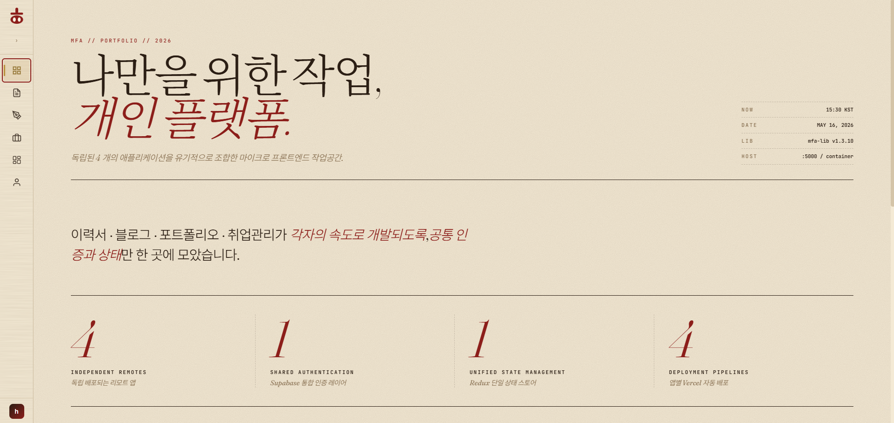
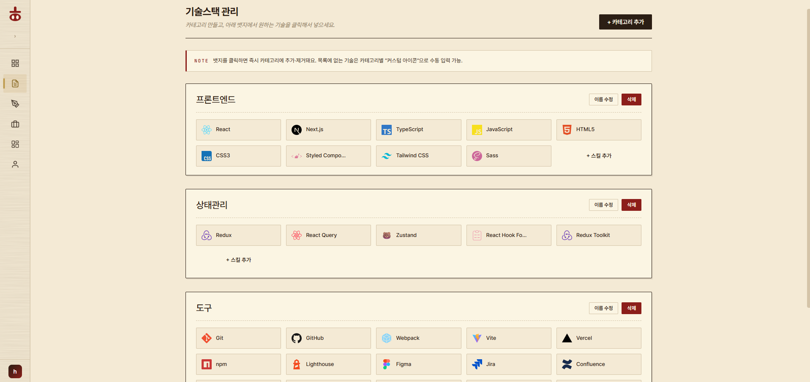
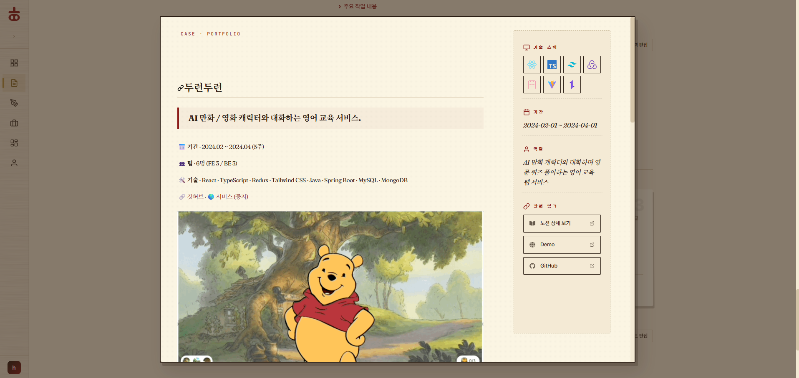

# 개인 플랫폼 — MFA 포트폴리오

> 이력서, 블로그, 포트폴리오를 **하나의 컨테이너**에서 운영하는 Micro Frontend 기반 개인 플랫폼

라우팅부터 인증, 공유 스토어까지 직접 설계하면서 MFA의 본질적인 문제들을 겪어봤습니다.  
"그냥 하나의 앱 아니야?"가 아니라, 각 Remote가 **독립 실행**되면서도 Host에 통합될 때 아무 문제 없어야 한다는 제약이 생각보다 까다로웠습니다.

---

## 화면

### 대시보드



Host가 올라오면 보이는 메인 화면. LNB는 각 Remote 앱이 자신의 메뉴 항목을 `expose`로 내보내고, Host가 런타임에 동적으로 조합합니다.

### 기술스택 관리 (Remote 에디터)



Resume 앱 안의 어드민 기능. 카테고리를 직접 만들고 기술을 쌓는 방식으로 이력서 기술스택을 관리합니다.

### 포트폴리오 상세 모달



Portfolio 앱의 프로젝트 상세 모달. 기간, 스택, 링크, 기여 내용을 한번에 볼 수 있습니다.

---

## 왜 MFA로 만들었나

처음엔 단순히 "기술 공부용"이었는데, 실제로 만들다 보니 개인 포트폴리오 사이트로 딱 맞는 구조였습니다.

- **이력서 앱**은 관리자만 편집, 방문자는 읽기만
- **블로그 앱**은 글쓰기 에디터와 뷰어가 분리
- **포트폴리오 앱**은 프로젝트 카드 + 상세 모달

기능 단위로 팀을 나누거나 배포 주기가 다르다면 MFA가 맞는 선택입니다. 그 경험을 개인 프로젝트 규모에서 직접 부딪히며 쌓았습니다.

---

## 아키텍처

```
┌────────────────────────────────────────────────────────┐
│                  Host (port 5000)                      │
│                                                        │
│  React Router  ·  Redux Store  ·  Auth  ·  LNB        │
│                                                        │
│   ┌──────────┐   ┌──────────┐   ┌──────────────────┐  │
│   │  resume  │   │   blog   │   │    portfolio     │  │
│   │  :5001   │   │  :5002   │   │      :5003       │  │
│   └──────────┘   └──────────┘   └──────────────────┘  │
│                                                        │
│   (런타임에 remoteEntry.js 로드 — 빌드 시 의존 없음)   │
└────────────────────────────────────────────────────────┘
                         │
              @sonhoseong/mfa-lib
         (공유 컴포넌트 · 훅 · 스토어 · 유틸)
```

각 Remote는 Host 없이도 `localhost:500x`에서 단독 실행됩니다. Host가 올라오면 `remoteEntry.js`를 런타임에 fetch해서 통합합니다.

### 핵심 설계 결정들

**1. Redux Store 공유 방식**

Host가 `window.__REDUX_STORE__`에 스토어를 노출하고 Remote들이 참조합니다. Module Federation의 `singleton` 설정으로 `react-redux`를 단일 인스턴스로 묶어서 인증 상태가 자연스럽게 공유됩니다.

**2. 라우팅 PREFIX 동적 계산**

```
Host 통합 시:   /blog/post/123  →  Remote는 /post/123 으로 받음  (PREFIX = '')
단독 실행 시:   /blog/post/123  →  Remote는 /blog/post/123     (PREFIX = '/blog')
```

`sessionStorage.isHostApp` 플래그로 실행 컨텍스트를 판별합니다.

**3. LNB 동적 조합**

```typescript
// Remote가 직접 메뉴 항목을 내보냄
export const lnbItems = {
    hasPrefixList: [{ id: 'blog-home', path: '/blog', ... }],
    hasPrefixAuthList: [...],
};

// Host가 런타임에 수집
const { lnbItems: blogItems } = await import('@blog/LnbItems');
```

Remote를 추가해도 Host 코드를 고칠 필요가 없습니다.

---

## 폴더 구조

```
mfa-monorepo/
├── apps/
│   ├── host/               # 컨테이너 앱 (port 5000)
│   │   └── src/
│   │       ├── components/ # Sidebar, Header 등 공통 UI
│   │       ├── pages/      # Dashboard, MyPage
│   │       └── setup/      # store, auth 초기화
│   │
│   ├── resume/             # 이력서 앱 (port 5001)
│   │   └── src/
│   │       ├── exposes/    # lnb-items, App 노출 진입점
│   │       ├── pages/      # resumes, admin (기술스택 편집)
│   │       └── network/    # API 훅 모음
│   │
│   ├── blog/               # 블로그 앱 (port 5002)
│   ├── portfolio/          # 포트폴리오 앱 (port 5003)
│   └── techblog/           # 기술블로그 앱 (port 5004)
│
└── packages/
    └── lib/                # @sonhoseong/mfa-lib
        └── src/
            ├── components/ # DeferredComponent, ErrorBoundary 등
            ├── hooks/      # useAuth, useLocalInitialize 등
            ├── store/      # authSlice, Redux 설정
            └── utils/      # storage (토큰·플래그 관리)
```

---

## 기술 스택

| 영역 | 기술 |
|------|------|
| Frontend | React 19, TypeScript 5 |
| 상태관리 | Redux Toolkit, React Redux |
| 빌드 | Webpack 5 Module Federation |
| 백엔드 | Supabase (PostgreSQL, Auth, Row-Level Security) |
| 배포 | Vercel (앱별 독립 프로젝트) |
| 공유 라이브러리 | `@sonhoseong/mfa-lib` (자체 패키지) |

---

## 로컬 실행

```bash
# 루트에서 전체 설치
npm install

# 전체 동시 실행 (권장)
npm run dev

# 앱별 개별 실행
npm run dev:host      # http://localhost:5000
npm run dev:resume    # http://localhost:5001
npm run dev:blog      # http://localhost:5002
npm run dev:portfolio # http://localhost:5003
```

> Remote가 먼저 떠 있어야 Host에서 정상 로드됩니다. `npm run dev`는 concurrently로 동시에 올립니다.

### 환경 변수

루트에 `.env` 생성:

```env
REACT_APP_SUPABASE_URL=your_supabase_url
REACT_APP_SUPABASE_ANON_KEY=your_supabase_anon_key
REMOTE1_URL=http://localhost:5001   # 로컬
REMOTE2_URL=http://localhost:5002
REMOTE3_URL=http://localhost:5003
```

### 테스트 계정

| 이메일 | 비밀번호 | 권한 |
|--------|----------|------|
| admin@test.com | 1234 | 관리자 (이력서·포트폴리오 편집 가능) |

---

## 배포 구조 (Vercel)

앱마다 독립 Vercel 프로젝트로 배포합니다.

| 앱 | Root Directory | 비고 |
|----|---------------|------|
| host | `apps/host` | 환경변수에 Remote URL 등록 필요 |
| resume | `apps/resume` | CORS 헤더 설정 필요 |
| blog | `apps/blog` | CORS 헤더 설정 필요 |
| portfolio | `apps/portfolio` | CORS 헤더 설정 필요 |

Host가 Remote의 `remoteEntry.js`를 fetch하므로, **Remote 앱의 Deployment Protection을 반드시 비활성화**해야 합니다.

```bash
# 빌드 (lib 먼저 빌드해야 Remote들이 최신 반영)
npm run build:lib
npm run build:all
```

---

## 겪었던 문제들

**캐시 버스팅**  
배포 후 `remoteEntry.js`가 캐싱되어 구버전 Remote가 로드되는 문제. 타임스탬프 쿼리스트링으로 1분 단위 캐시 무효화로 해결했습니다.

**단독/Host 혼용 라우팅**  
동일한 URL이 실행 컨텍스트에 따라 다르게 파싱되어야 하는 문제. PREFIX를 런타임에 계산하는 패턴으로 정리했습니다.

**스켈레톤 깜빡임**  
빠른 로딩(150ms 미만)에서도 스켈레톤이 잠깐 보이는 플리커 현상. `DeferredComponent`로 지연 마운트해서 해결했습니다.

**lib 빌드 순서**  
`@sonhoseong/mfa-lib` 변경 후 빌드 없이 Remote를 실행하면 이전 dist가 참조되어 런타임 에러 발생. `build:all` 스크립트에 lib 빌드를 앞에 강제했습니다.
