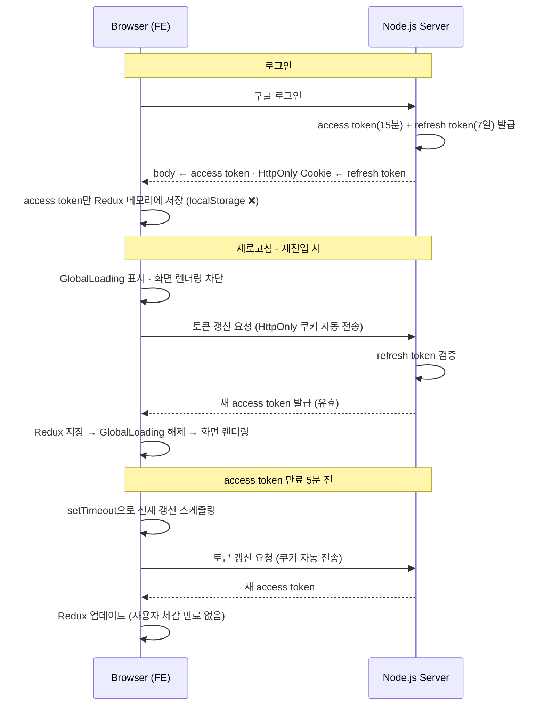
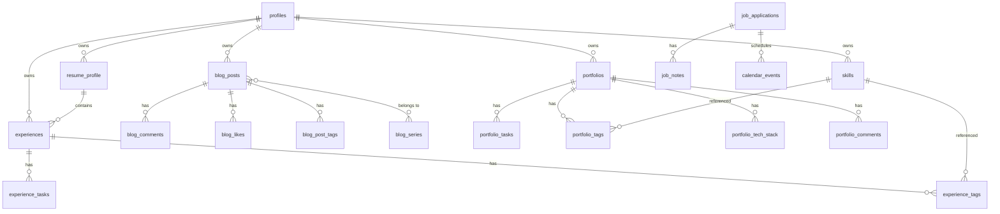
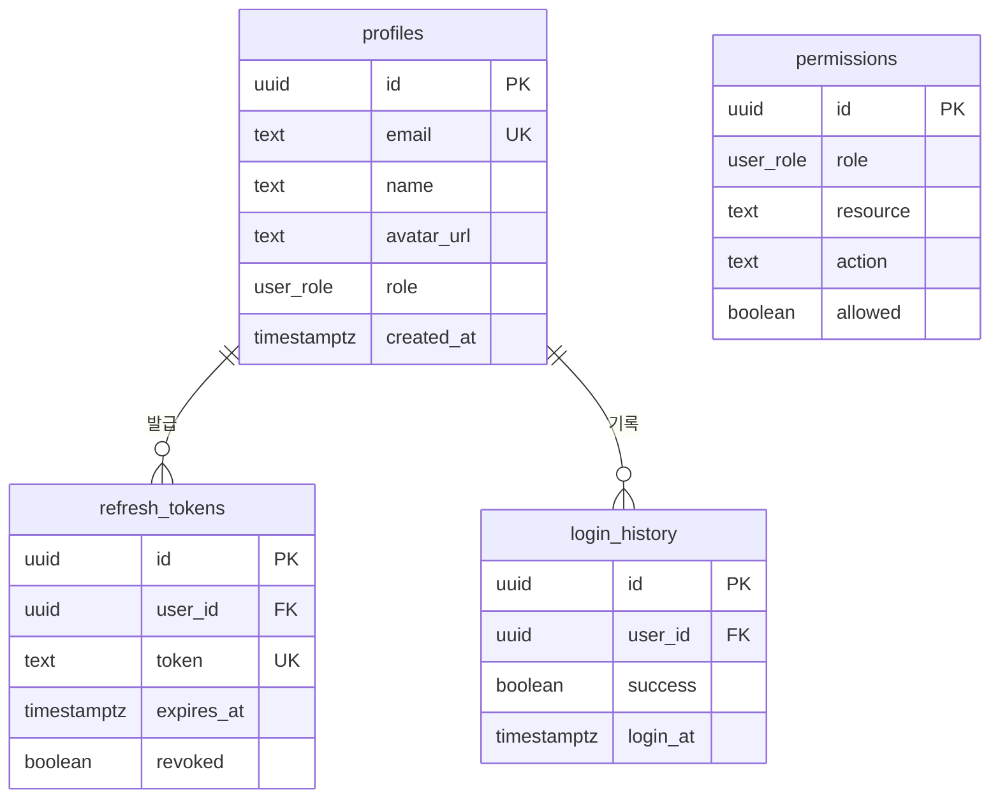
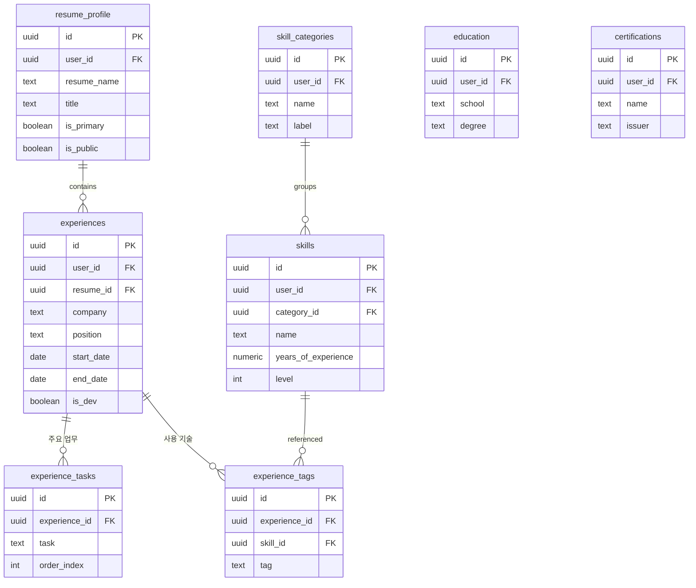
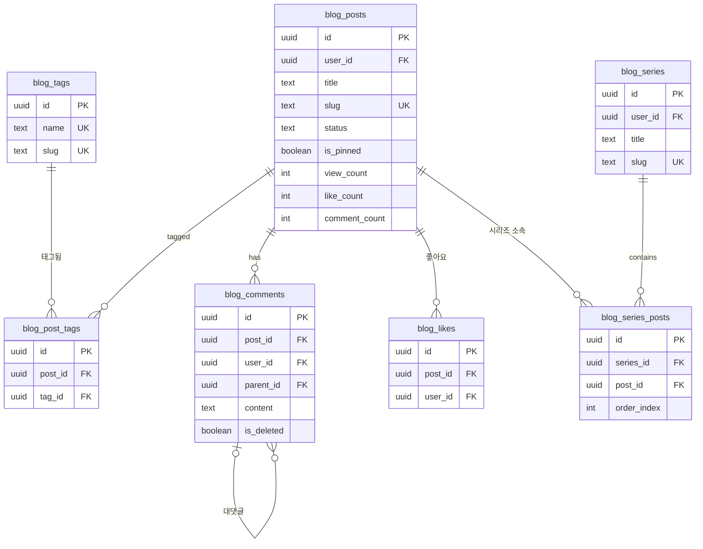
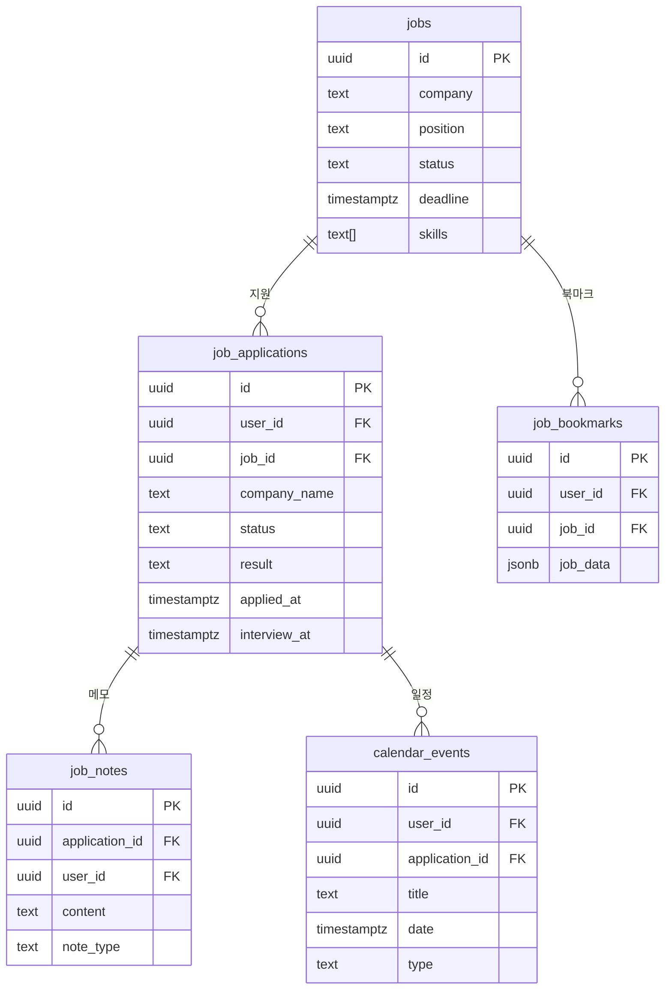

# 커리어허브

> 이력서, 블로그, 포트폴리오를 한 곳에서 작성하고 발행할 수 있는 개인 커리어 관리 플랫폼

🌎 **배포 URL** · [https://personal-platform-alpha.vercel.app](https://personal-platform-alpha.vercel.app)

커리어허브는 자신의 커리어를 정리하고 공유할 수 있는 커리어 관리 플랫폼입니다.
지원 직무에 맞춰 여러 개의 이력서를 작성하고 노출할 프로젝트 조합을 관리할 수 있습니다.
포트폴리오에 진행한 프로젝트의 기간·기술·역할·고민과 해결 과정을 정리해 카드와 상세 모달로 보여줍니다.
블로그에 학습 기록과 트러블슈팅을 글로 정리해 공개/비공개로 발행할 수 있습니다.
다른 유저의 이력서와 블로그를 둘러보고 팔로우·좋아요·댓글·SNS 공유로 상호작용할 수 있습니다.

---

## 화면

### 대시보드


로그인 후 처음 보이는 메인 화면. 좌측 사이드바에서 이력서·블로그·포트폴리오로 이동할 수 있고, 작성한 글과 프로젝트 현황을 한눈에 확인합니다.

### 기술스택 관리


이력서에 노출할 기술스택을 카테고리별로 직접 추가하고 관리합니다. 카테고리·기술 항목·숙련도까지 모두 사용자가 정의합니다.

### 포트폴리오 상세 모달


프로젝트 카드를 클릭하면 기간·기술스택·링크·기여 내용·성과를 한 화면에서 확인할 수 있습니다.

---

## 아키텍처

> 독립 배포와 단일 사용자 경험을 동시에 만족시키기 위한 설계 결정들.

### 공유 스토어

호스트의 Redux 스토어 인스턴스를 `window.__REDUX_STORE__` 전역 객체로 노출해 모든 리모트가 동일 인스턴스를 참조하도록 했습니다. Module Federation 의 `singleton: true` 설정만으로는 React Redux 컨텍스트가 리모트마다 분리되어 `useSelector` 가 비어 있는 문제가 있었습니다.

### 동적 라우팅 PREFIX

단독 실행과 호스트 통합, 두 컨텍스트에서 동일 URL 이 다르게 해석되어야 합니다. 호스트가 마운트될 때 통합 실행을 알리는 플래그를 심어 두고, 리모트는 자기 라우터가 초기화될 때 그 플래그를 읽어 자신의 베이스 경로를 런타임에 계산합니다. 같은 코드베이스로 단독 실행과 통합 실행 모두 자연스럽게 동작합니다.

### LNB 동적 조합

리모트가 자신의 메뉴 항목을 `expose` 로 내보내고, 호스트가 런타임에 수집해 사이드바를 구성합니다. 리모트마다 자기 영역의 네비게이션 정책을 가져갈 수 있습니다.

### 공유 라이브러리

공통 컴포넌트·훅·스토어·유틸은 `@sonhoseong/mfa-lib` 한 패키지에 모아 모든 앱이 동일한 단일 인스턴스를 공유합니다.

---

## 🛠 기술 스택

### Frontend
   

   

### Backend
  

### Infrastructure
  

---

## 📌 기능

### 이력서
- 직무별로 여러 개의 이력서를 작성하고 공개·비공개·메인 설정으로 노출 관리
- 경력·프로젝트·기술스택·학력·자격증을 각각 별도 항목으로 추가
- 기술스택은 카테고리부터 직접 만들어 자유롭게 구성
- 본인 노션 페이지를 연동해 이력 콘텐츠를 그대로 임베드 노출

### 블로그
- 리치 텍스트 에디터(Tiptap) 기반 글 작성, 코드 블록은 구문 강조 지원
- 태그·시리즈로 글 그룹화, 좋아요·댓글·대댓글
- 발행 / 임시 저장 / 비공개 상태 관리

### 포트폴리오
- 프로젝트 카드 + 상세 모달로 기간·기술·역할·기여 내용 표시
- 이력서별로 노출할 프로젝트 조합을 따로 지정
- 카테고리·이미지·마일스톤·성과 지표 관리
- 노션 페이지를 연동해 포트폴리오 본문을 노션에서 작성하고 그대로 노출

### 공통
- Google OAuth 로그인 + 자체 JWT(AccessToken + HttpOnly RefreshToken) 인증
- 다른 유저의 이력서·블로그·포트폴리오 둘러보기 + 팔로우 / 좋아요 / 댓글 / SNS 공유
- 대시보드에서 본인의 글·프로젝트·지원 현황 한눈에 확인

---

## 🚀 성과

### Remote 간 인증 상태 동기화

**고민** — 독립적으로 실행되는 리모트들이 동일한 인증 상태를 바라보도록 호스트의 인증 스토어를 공유해야 했다. 개인 프로젝트 규모에서는 인증 상태 일관성과 독립 개발 환경 유지에 우선순위를 두었다.

**해결** — 호스트가 자신의 Redux 스토어 인스턴스를 전역 객체로 노출하고, 리모트들이 이를 참조해 동일한 인증 상태를 공유하도록 했다. 리모트가 단독 실행될 때는 자체 로컬 스토어로 자동 fallback 한다.

**결과** — 사용자는 앱 간 이동 시 재로그인할 필요가 없고, 로그아웃 한 번으로 모든 리모트의 인증 상태가 즉시 동기화된다.

---

### MFA 환경을 위한 중앙 집중형 인증 시스템

**고민** — 호스트와 리모트가 하나의 서비스처럼 동작하려면 인증 상태를 일관되게 유지해야 했다. Access Token 은 짧은 수명(15 분) 으로 Redux 메모리에만 두고, Refresh Token 은 7 일 HttpOnly 쿠키로 분리 관리하는 구조를 설계했다.

**인증 플로우 전체**


```mermaid
sequenceDiagram
    participant B as Browser (FE)
    participant N as Node.js Server

    Note over B,N: 로그인
    B->>N: 구글 로그인
    N->>N: access token(15분) + refresh token(7일) 발급
    N-->>B: body ← access token · HttpOnly Cookie ← refresh token
    B->>B: access token만 Redux 메모리에 저장 (localStorage ❌)

    Note over B,N: 새로고침 · 재진입 시
    B->>B: GlobalLoading 표시 · 화면 렌더링 차단
    B->>N: 토큰 갱신 요청 (HttpOnly 쿠키 자동 전송)
    N->>N: refresh token 검증
    N-->>B: 새 access token 발급 (유효)
    B->>B: Redux 저장 → GlobalLoading 해제 → 화면 렌더링

    Note over B,N: access token 만료 5분 전
    B->>B: setTimeout으로 선제 갱신 스케줄링
    B->>N: 토큰 갱신 요청 (쿠키 자동 전송)
    N-->>B: 새 access token
    B->>B: Redux 업데이트 (사용자 체감 만료 없음)
```

**세션 복원 UX 이슈** — Access Token 이 휘발되는 순간 로그인 페이지가 잠깐 노출되는 플리커가 발생했다. 인증 복원이 끝날 때까지 전역 로딩(GlobalLoading) 으로 화면 렌더링을 지연시켜 해당 현상을 제거했다.

**선제 갱신 스케줄링** — Access Token 만료 5 분 전 `setTimeout` 으로 갱신을 예약, 사용자 체감 만료를 제거했다.

**결과** — 인증 로직을 중앙화해 앱을 이동해도 재로그인이 필요 없고, Refresh Token 을 HttpOnly Cookie 로 관리해 토큰 노출 위험을 줄였다.

---

### Module Federation 환경에서 단일 장애점 제거

**고민** — 리모트 4 개를 독립 배포하는 과정에서 *특정 리모트 장애가 호스트 전체에 영향을 주는* 문제를 발견했다. 리모트 로딩 과정을 직접 제어하는 동적 로더로 해결하기로 했다.

**해결** — 자체 동적 로더(~ 60 LOC) 가 ① 1 분 단위 타임스탬프로 최신 `remoteEntry.js` 로드, ② 이미 로드된 리모트 재사용, ③ 로드 실패 시 fallback UI 제공을 담당한다.

**결과** — 리모트 장애가 발생해도 다른 기능은 정상 동작하며, 재배포 후 최신 번들이 즉시 반영된다.

---

## 🔥 트러블슈팅

### 1. 페이지 이동 시 사용자 정보가 사라지는 무한 리렌더링

**문제** — 페이지를 이동하면 사용자 정보가 사라지고 로그인이 풀린 것처럼 보였다. 동시에 컴포넌트가 의미 없이 계속 재렌더링되었다.

**추적** — 초기에는 인증 로직과 스토어 동기화를 의심했지만, 실제 Redux state 는 정상이었다. 인증 로직 / 스토어 동기화 / `useSyncExternalStore` 세 가지 가설을 세우고 하나씩 좁힌 끝에, `getSnapshot` 이 매 호출마다 *새로운 객체 참조* 를 반환하는 지점을 발견했다.

**원인** — React 19 의 `useSyncExternalStore` 는 같은 데이터에 대해 같은 참조를 반환하는 `getSnapshot` 을 요구한다. 기존 구현은 Redux state 가 비어 있을 때 localStorage fallback 으로 떨어졌고, 이 fallback 이 `JSON.parse` 로 매번 새 객체를 만들었다. 데이터는 같아도 참조가 달라 React 는 변경으로 인식, 무한 리렌더링이 발생했다.

**해결** — localStorage fallback 을 제거하고 Redux 메모리를 단일 source 로 통일했다. Redux 는 동일 state 에 대해 같은 참조를 유지하므로 참조 안정성이 자동으로 충족된다.

---

### 2. 특정 리모트 진입 시 Invalid Hook Call

**문제** — 호스트에서 특정 리모트로 진입하면 `Invalid Hook Call` 에러가 발생하며 화면이 렌더링되지 않았다. 같은 리모트를 단독으로 실행하면 정상이었다.

**원인** — 호스트와 리모트가 *각자 즉시 React 를 초기화* 하면서 동일 페이지에 서로 다른 React 인스턴스가 충돌했다. React 는 모듈 단위로 내부 상태를 유지하기 때문에 인스턴스가 둘이면 hook dispatcher 가 어긋난다.

**고민** — Module Federation 의 `shared` 모듈에 `singleton: true` 만 주면 충분할 줄 알았지만 충돌이 계속됐다. `eager: true / false` 사이에서 *언제 누가* React 를 로드하는지 협상 동작을 추적하다가, `eager: true` 가 협상 단계를 건너뛰고 동기 초기화를 강제한다는 점을 확인했다. 호스트와 리모트가 모두 `eager: true` 면 둘 다 자기 React 를 들고 와버린다.

**해결** — 리모트의 `shared` 에서 `eager: true` 를 빼고, 즉시 초기화는 호스트만 담당하도록 분리했다. 리모트는 `eager: false` 로 두어 협상 단계에서 호스트가 이미 로드한 React 를 재사용한다.

---

## 로컬 실행

```bash
# 루트에서 전체 설치
npm install

# 전체 동시 실행 (권장)
npm run dev

# 앱별 개별 실행
npm run dev:host      # http://localhost:5000
npm run dev:resume    # http://localhost:5001
npm run dev:blog      # http://localhost:5002
npm run dev:portfolio # http://localhost:5003
```

> Remote가 먼저 떠 있어야 Host에서 정상 로드됩니다. `npm run dev`는 concurrently로 동시에 올립니다.

### 환경 변수

루트에 `.env` 생성:

```env
REACT_APP_SUPABASE_URL=your_supabase_url
REACT_APP_SUPABASE_ANON_KEY=your_supabase_anon_key
REMOTE1_URL=http://localhost:5001   # 로컬
REMOTE2_URL=http://localhost:5002
REMOTE3_URL=http://localhost:5003
```

---

## 배포 구조 (Vercel)

앱마다 독립 Vercel 프로젝트로 배포합니다.

| 앱 | Root Directory |
|----|---------------|
| host | `apps/host` |
| resume | `apps/resume` |
| blog | `apps/blog` |
| portfolio | `apps/portfolio` |
| api | `apps/api` |

Host가 Remote의 `remoteEntry.js`를 fetch하므로, **Remote 앱의 Deployment Protection을 반드시 비활성화**해야 합니다.

```bash
# 빌드 (lib 먼저 빌드해야 Remote들이 최신 반영)
npm run build:lib
npm run build:all
```

---

## 백엔드 API 아키텍처 (Express MVC)

```
apps/api/src/
├── modules/
│   ├── auth/       ├── blog/       ├── portfolio/
│   ├── user/       └── upload/
├── middleware/     authenticate.ts
├── common/         response.ts
├── lib/            supabase.ts · token.ts
└── config/         env.ts
```

도메인별로 `router / controller / service` 3파일이 한 폴더에 모입니다. Service는 Supabase 쿼리만, Controller는 req/res 파싱과 응답 전송만 담당합니다.

**인증 흐름 — OAuth 콜백에서 토큰을 URL로 안 넘기는 이유**

Google 로그인 콜백 후 프론트에 AccessToken을 전달할 때, URL 파라미터(`?token=xxx`)로 넘기면 브라우저 히스토리와 Referer 헤더에 토큰이 남습니다. 대신 **1분짜리 단기 쿠키**(`access_token_once`)에 담아서 리다이렉트하고, 프론트가 읽는 즉시 쿠키를 삭제합니다. RefreshToken은 7일짜리 HttpOnly 쿠키로 별도 관리합니다.

---

## 데이터베이스 스키마 (ERD)

> Supabase PostgreSQL 17 · 모든 테이블 RLS 활성화

### 전체 도메인 구조


```mermaid
erDiagram
    profiles ||--o{ blog_posts : owns
    profiles ||--o{ portfolios : owns
    profiles ||--o{ resume_profile : owns
    profiles ||--o{ experiences : owns
    profiles ||--o{ skills : owns

    blog_posts ||--o{ blog_comments : has
    blog_posts ||--o{ blog_likes : has
    blog_posts ||--o{ blog_post_tags : has
    blog_posts }o--o{ blog_series : "belongs to"

    portfolios ||--o{ portfolio_tasks : has
    portfolios ||--o{ portfolio_tags : has
    portfolios ||--o{ portfolio_tech_stack : has
    portfolios ||--o{ portfolio_comments : has

    resume_profile ||--o{ experiences : contains
    experiences ||--o{ experience_tasks : has
    experiences ||--o{ experience_tags : has

    skills ||--o{ experience_tags : referenced
    skills ||--o{ portfolio_tags : referenced

    job_applications ||--o{ job_notes : has
    job_applications ||--o{ calendar_events : schedules
```

---

### Auth / 사용자 도메인


```mermaid
erDiagram
    profiles {
        uuid id PK
        text email UK
        text name
        text avatar_url
        user_role role
        timestamptz created_at
    }
    refresh_tokens {
        uuid id PK
        uuid user_id FK
        text token UK
        timestamptz expires_at
        boolean revoked
    }
    login_history {
        uuid id PK
        uuid user_id FK
        boolean success
        timestamptz login_at
    }
    permissions {
        uuid id PK
        user_role role
        text resource
        text action
        boolean allowed
    }

    profiles ||--o{ refresh_tokens : "발급"
    profiles ||--o{ login_history : "기록"
```

---

### Resume 도메인


```mermaid
erDiagram
    resume_profile {
        uuid id PK
        uuid user_id FK
        text resume_name
        text title
        boolean is_primary
        boolean is_public
    }
    experiences {
        uuid id PK
        uuid user_id FK
        uuid resume_id FK
        text company
        text position
        date start_date
        date end_date
        boolean is_dev
    }
    experience_tasks {
        uuid id PK
        uuid experience_id FK
        text task
        int order_index
    }
    experience_tags {
        uuid id PK
        uuid experience_id FK
        uuid skill_id FK
        text tag
    }
    skill_categories {
        uuid id PK
        uuid user_id FK
        text name
        text label
    }
    skills {
        uuid id PK
        uuid user_id FK
        uuid category_id FK
        text name
        numeric years_of_experience
        int level
    }
    education {
        uuid id PK
        uuid user_id FK
        text school
        text degree
    }
    certifications {
        uuid id PK
        uuid user_id FK
        text name
        text issuer
    }

    resume_profile ||--o{ experiences : contains
    experiences ||--o{ experience_tasks : "주요 업무"
    experiences ||--o{ experience_tags : "사용 기술"
    skill_categories ||--o{ skills : groups
    skills ||--o{ experience_tags : referenced
```

---

### Blog 도메인


```mermaid
erDiagram
    blog_posts {
        uuid id PK
        uuid user_id FK
        text title
        text slug UK
        text status
        boolean is_pinned
        int view_count
        int like_count
        int comment_count
    }
    blog_tags {
        uuid id PK
        text name UK
        text slug UK
    }
    blog_post_tags {
        uuid id PK
        uuid post_id FK
        uuid tag_id FK
    }
    blog_comments {
        uuid id PK
        uuid post_id FK
        uuid user_id FK
        uuid parent_id FK
        text content
        boolean is_deleted
    }
    blog_likes {
        uuid id PK
        uuid post_id FK
        uuid user_id FK
    }
    blog_series {
        uuid id PK
        uuid user_id FK
        text title
        text slug UK
    }
    blog_series_posts {
        uuid id PK
        uuid series_id FK
        uuid post_id FK
        int order_index
    }

    blog_posts ||--o{ blog_post_tags : tagged
    blog_tags ||--o{ blog_post_tags : "태그됨"
    blog_posts ||--o{ blog_comments : has
    blog_comments |o--o{ blog_comments : "대댓글"
    blog_posts ||--o{ blog_likes : "좋아요"
    blog_series ||--o{ blog_series_posts : contains
    blog_posts ||--o{ blog_series_posts : "시리즈 소속"
```

---

### Portfolio 도메인


```mermaid
erDiagram
    portfolios {
        uuid id PK
        uuid user_id FK
        uuid category_id FK
        uuid resume_id FK
        text title
        text slug UK
        boolean show_on_resume
        boolean is_featured
        text role
    }
    portfolio_categories {
        uuid id PK
        uuid user_id FK
        text name
        text slug UK
    }
    portfolio_tasks {
        uuid id PK
        uuid portfolio_id FK
        text task
    }
    portfolio_results {
        uuid id PK
        uuid portfolio_id FK
        text result
        text metric_value
    }
    portfolio_tags {
        uuid id PK
        uuid portfolio_id FK
        uuid skill_id FK
        text tag
    }
    portfolio_tech_stack {
        uuid id PK
        uuid portfolio_id FK
        text category
        text name
    }
    portfolio_images {
        uuid id PK
        uuid portfolio_id FK
        text image_url
        boolean is_cover
    }
    portfolio_milestones {
        uuid id PK
        uuid portfolio_id FK
        text title
        date date
    }
    portfolio_comments {
        uuid id PK
        uuid portfolio_id FK
        uuid user_id FK
        uuid parent_id FK
        text content
    }

    portfolio_categories ||--o{ portfolios : groups
    portfolios ||--o{ portfolio_tasks : "주요 업무"
    portfolios ||--o{ portfolio_results : "성과"
    portfolios ||--o{ portfolio_tags : "기술 태그"
    portfolios ||--o{ portfolio_tech_stack : "기술 스택"
    portfolios ||--o{ portfolio_images : "이미지"
    portfolios ||--o{ portfolio_milestones : "마일스톤"
    portfolios ||--o{ portfolio_comments : "댓글"
    portfolio_comments |o--o{ portfolio_comments : "대댓글"
```

---

### Techblog (취업 트래커) 도메인


```mermaid
erDiagram
    jobs {
        uuid id PK
        text company
        text position
        text status
        timestamptz deadline
        text[] skills
    }
    job_applications {
        uuid id PK
        uuid user_id FK
        uuid job_id FK
        text company_name
        text status
        text result
        timestamptz applied_at
        timestamptz interview_at
    }
    job_notes {
        uuid id PK
        uuid application_id FK
        uuid user_id FK
        text content
        text note_type
    }
    job_bookmarks {
        uuid id PK
        uuid user_id FK
        uuid job_id FK
        jsonb job_data
    }
    calendar_events {
        uuid id PK
        uuid user_id FK
        uuid application_id FK
        text title
        timestamptz date
        text type
    }

    jobs ||--o{ job_applications : "지원"
    jobs ||--o{ job_bookmarks : "북마크"
    job_applications ||--o{ job_notes : "메모"
    job_applications ||--o{ calendar_events : "일정"
```

---

## 🗂 폴더 구조

```
mfa-monorepo/
├── apps/
│   ├── host/               # 컨테이너 앱 (port 5000)
│   ├── resume/             # 이력서 앱 (port 5001)
│   ├── blog/               # 블로그 앱 (port 5002)
│   ├── portfolio/          # 포트폴리오 앱 (port 5003)
│   ├── techblog/           # 기술블로그 앱 (port 5004)
│   └── api/                # Express API 서버 (port 4000)
│
└── packages/
    └── lib/                # @sonhoseong/mfa-lib
        └── src/
            ├── components/ # DeferredComponent, ErrorBoundary 등
            ├── hooks/      # useAuth, useLocalInitialize 등
            ├── store/      # authSlice, Redux 설정
            └── network/    # apiClient, 공유 axios 인스턴스
```

---

## 향후 개선 로드맵

- **이력서별 독립 URL 발급** — 회사별 맞춤 노출을 위한 JWT 서명 URL + per-resume slug 도입
- **Turborepo 도입** — `packages/lib/dist` 를 git 에 강제 commit 하는 임시 방편 정리
- **Module Federation 2.0 마이그레이션** — 자체 동적 로더를 `@module-federation/runtime` 으로 교체
- **E2E 테스트(Playwright)** — 리모트 간 인증 전파·라우팅·LNB 동적 조합 통합 시나리오 자동화
- **모바일 PWA** — 반응형을 넘어 Service Worker + 오프라인 캐시까지 확장
