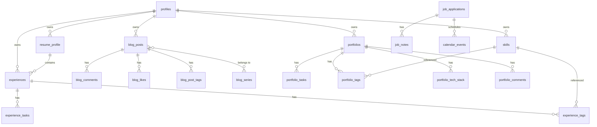
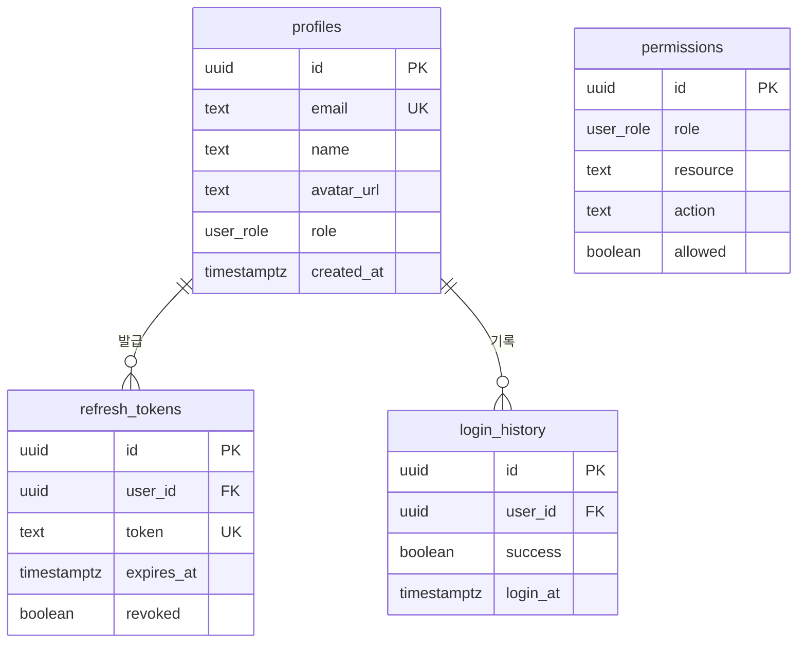
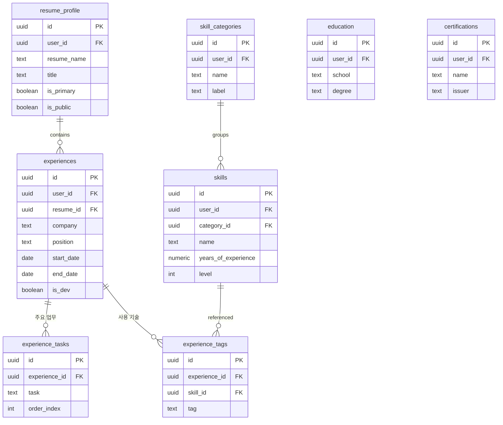
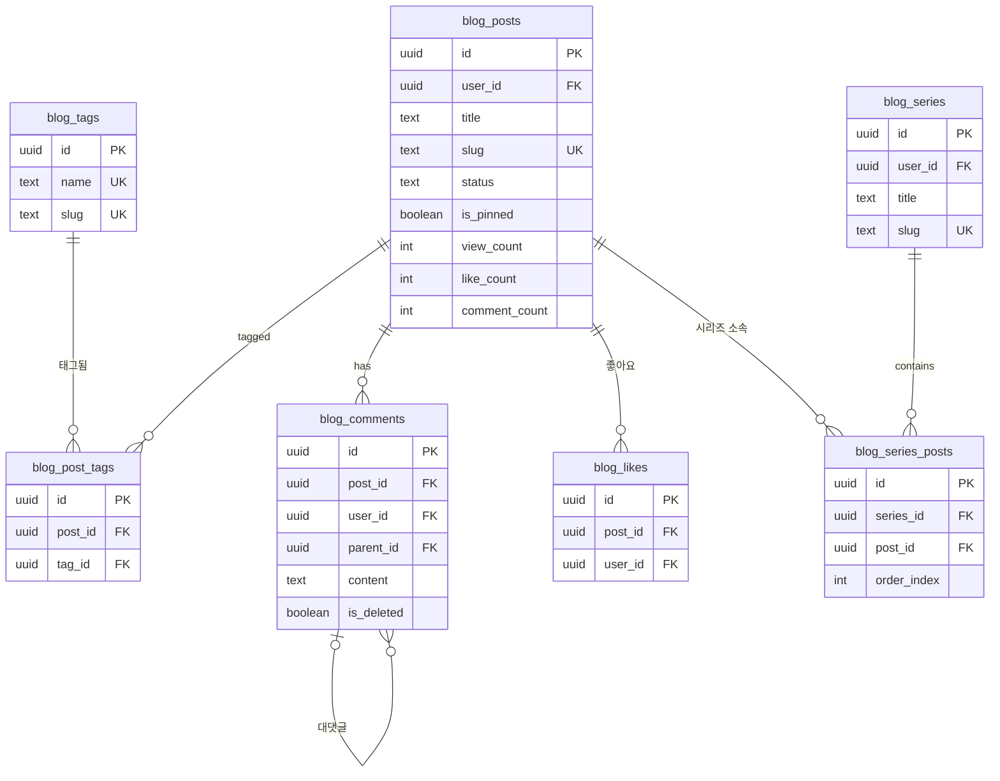
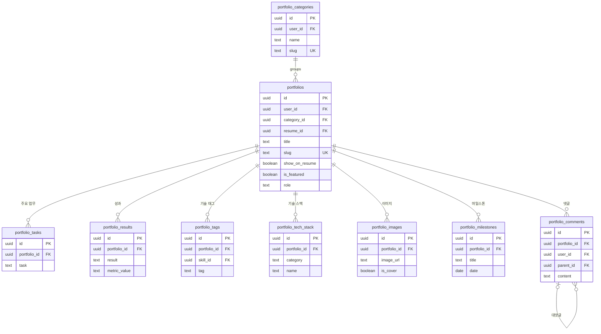
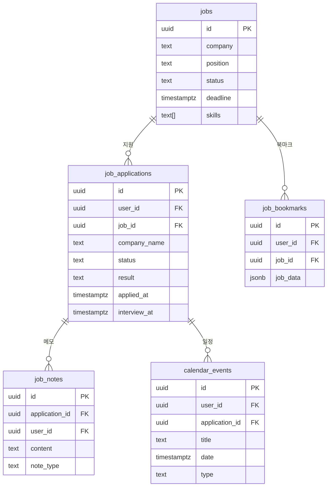

# 커리어허브

> 이력서, 블로그, 포트폴리오를 한 곳에서 작성하고 발행할 수 있는 개인 커리어 관리 플랫폼

커리어허브는 자신의 커리어를 정리하고 공유할 수 있는 SNS형 커리어 관리 플랫폼입니다.
지원 직무에 맞춰 여러 개의 이력서를 작성하고 노출할 프로젝트 조합을 관리할 수 있습니다.
포트폴리오에 진행한 프로젝트의 기간·기술·역할·고민과 해결 과정을 정리해 카드와 상세 모달로 보여줍니다.
블로그에 학습 기록과 트러블슈팅을 글로 정리해 공개/비공개로 발행할 수 있습니다.
다른 유저의 이력서와 블로그를 둘러보고 팔로우·좋아요·댓글·SNS 공유로 상호작용할 수 있습니다.

---

## 화면

### 대시보드


Host가 올라오면 보이는 메인 화면. LNB는 각 Remote 앱이 자신의 메뉴 항목을 `expose`로 내보내고, Host가 런타임에 동적으로 조합합니다.

### 기술스택 관리 (Remote 에디터)


Resume 앱 안의 어드민 기능. 카테고리를 직접 만들고 기술을 쌓는 방식으로 이력서 기술스택을 관리합니다.

### 포트폴리오 상세 모달


Portfolio 앱의 프로젝트 상세 모달. 기간, 스택, 링크, 기여 내용을 한번에 볼 수 있습니다.

---

## 왜 MFA로 만들었나

처음엔 단순히 "기술 공부용"이었는데, 실제로 만들다 보니 개인 포트폴리오 사이트로 딱 맞는 구조였습니다.

- **이력서 앱**은 관리자만 편집, 방문자는 읽기만
- **블로그 앱**은 글쓰기 에디터와 뷰어가 분리
- **포트폴리오 앱**은 프로젝트 카드 + 상세 모달

기능 단위로 팀을 나누거나 배포 주기가 다르다면 MFA가 맞는 선택입니다. 그걸 개인 프로젝트 규모에서 한번 해봤습니다.

다만 솔직히 말하면, 초기 설정 비용이 꽤 높습니다. 공유 라이브러리 빌드 순서, 타입 공유, singleton 설정까지 하나라도 빠지면 빈 화면입니다. "그냥 Next.js 하나로 만들 걸"이라는 생각을 여러 번 했습니다.

---

## 아키텍처

```
┌────────────────────────────────────────────────────────┐
│                  Host (port 5000)                      │
│                                                        │
│  React Router  ·  Redux Store  ·  Auth  ·  LNB        │
│                                                        │
│   ┌──────────┐   ┌──────────┐   ┌──────────────────┐  │
│   │  resume  │   │   blog   │   │    portfolio     │  │
│   │  :5001   │   │  :5002   │   │      :5003       │  │
│   └──────────┘   └──────────┘   └──────────────────┘  │
│                                                        │
│   (런타임에 remoteEntry.js 로드 — 빌드 시 의존 없음)   │
└────────────────────────────────────────────────────────┘
                         │
              @sonhoseong/mfa-lib
         (공유 컴포넌트 · 훅 · 스토어 · 유틸)
```

각 Remote는 Host 없이도 `localhost:500x`에서 단독 실행됩니다. Host가 올라오면 `remoteEntry.js`를 런타임에 fetch해서 통합합니다.

### 핵심 설계 결정들

### Redux Store 공유

Host가 `window.__REDUX_STORE__`에 스토어를 노출하고 Remote들이 참조합니다. Module Federation의 `singleton` 설정으로 `react-redux`를 단일 인스턴스로 묶지 않으면, Remote마다 별도 React 컨텍스트가 생겨서 `useSelector`가 아무것도 읽지 못합니다. 실제로 이 설정 빠진 상태에서 인증 상태가 통째로 날아가는 걸 겪어봤습니다.

### 라우팅 PREFIX 동적 계산

```
Host 통합 시:   /blog/post/123  →  Remote는 /post/123 으로 받음  (PREFIX = '')
단독 실행 시:   /blog/post/123  →  Remote는 /blog/post/123     (PREFIX = '/blog')
```

`sessionStorage.isHostApp` 플래그로 실행 컨텍스트를 판별합니다.

### LNB 동적 조합

```typescript
// Remote가 직접 메뉴 항목을 내보냄
export const lnbItems = {
    hasPrefixList: [{ id: 'blog-home', path: '/blog', ... }],
    hasPrefixAuthList: [...],
};

// Host가 런타임에 수집
const { lnbItems: blogItems } = await import('@blog/LnbItems');
```

Remote를 새로 붙여도 Host 건드릴 일이 없습니다.

---

## 폴더 구조

```
mfa-monorepo/
├── apps/
│   ├── host/               # 컨테이너 앱 (port 5000)
│   ├── resume/             # 이력서 앱 (port 5001)
│   ├── blog/               # 블로그 앱 (port 5002)
│   ├── portfolio/          # 포트폴리오 앱 (port 5003)
│   ├── techblog/           # 기술블로그 앱 (port 5004)
│   └── api/                # Express API 서버 (port 4000)
│
└── packages/
    └── lib/                # @sonhoseong/mfa-lib
        └── src/
            ├── components/ # DeferredComponent, ErrorBoundary 등
            ├── hooks/      # useAuth, useLocalInitialize 등
            ├── store/      # authSlice, Redux 설정
            └── network/    # apiClient, 공유 axios 인스턴스
```

---

## 기술 스택

| 영역 | 기술 |
|------|------|
| Frontend | React 19, TypeScript 5 |
| 상태관리 | Redux Toolkit, React Redux |
| 빌드 | Webpack 5 Module Federation |
| 백엔드 API | Express.js (Node.js, MVC 패턴) |
| 인증 | Google OAuth 2.0 + JWT (AccessToken + HttpOnly RefreshToken) |
| 데이터베이스 | Supabase (PostgreSQL 17 + RLS + Storage) |
| 배포 | Vercel (앱별 독립 프로젝트) |
| 공유 라이브러리 | `@sonhoseong/mfa-lib` (자체 패키지) |

---

## 기술 의사결정 (선택 근거)

> 단순 사용 기술이 아니라 "왜 이걸 골랐는가" 의 근거. 면접 단골 질문 선점용.

| 결정 영역 | 선택 | 검토했던 대안 | 선택 이유 |
|---|---|---|---|
| FE 아키텍처 | **Module Federation (Webpack 5)** | Next.js 단일 앱 · Nx workspace · iframe 임베드 | Remote 4 개를 *런타임* 에 통합해야 했고, 각 앱이 단독 배포·실행 가능해야 함. 빌드 시 의존성 0 |
| 상태관리 | **Redux Toolkit + `window.__REDUX_STORE__`** | Zustand · Jotai · Context API | Host 와 Remote 가 **동일 store 인스턴스** 를 공유해야 인증 상태가 일관됨. Context 는 각 Remote 가 자기 React 트리를 갖기 때문에 분리됨 |
| 인증 구현 | **자체 JWT (Express + jose)** | Supabase Auth · NextAuth · Auth0 | JWT 구조·Refresh Rotation·HttpOnly Cookie 직접 학습 + Refresh Token DB 저장으로 *서버 측 revoke* 가능 |
| Refresh Token 저장 | **HttpOnly Cookie (7 일)** | localStorage · sessionStorage · Redux | XSS 차단 (JS 접근 불가). Access Token 은 Redux 메모리만 — 새로고침마다 silent refresh |
| Access Token 콜백 전달 | **1 분짜리 단기 쿠키** (`access_token_once`) | URL 쿼리스트링 · postMessage · 페이지 변수 | URL/Referer/히스토리 노출 차단. 1 분 TTL 로 탈취 시점 제한 |
| 백엔드 | **Express MVC (별도 Vercel 프로젝트)** | Next.js API Routes · Fastify · NestJS | FE 와 BE 배포 주기·언어·런타임 분리. MVC 3 파일(router/controller/service) 강제로 응집도 ↑ |
| DB & 권한 | **Supabase RLS + Express middleware 이중** | Firebase · 자체 PG | RLS 로 *데이터 레이어* 권한 1 차 차단, middleware 로 *비즈니스 레이어* 2 차 차단. Defense in depth |
| 공유 코드 배포 | **자체 npm 패키지** `@sonhoseong/mfa-lib` | npm workspaces symlink · git submodule | Module Federation `shared.requiredVersion` 협상이 정식 패키지 메타데이터를 요구. symlink 만으로는 version 매칭 실패 가능 |
| Remote 로더 | **자체 동적 로더 (~60 LOC)** | `@module-federation/runtime` 공식 패키지 | 캐시 무효화 정책(1 분 타임스탬프)·fallback UI·timeout 을 프로젝트 정책대로 직접 제어 |

---

## 백엔드 API 아키텍처 (Express MVC)

```
apps/api/src/
├── modules/
│   ├── auth/       ├── blog/       ├── portfolio/
│   ├── user/       └── upload/
├── middleware/     authenticate.ts
├── common/         response.ts
├── lib/            supabase.ts · token.ts
└── config/         env.ts
```

도메인별로 `router / controller / service` 3파일이 한 폴더에 모입니다. Service는 Supabase 쿼리만, Controller는 req/res 파싱과 응답 전송만 담당합니다.

**인증 흐름 — OAuth 콜백에서 토큰을 URL로 안 넘기는 이유**

Google 로그인 콜백 후 프론트에 AccessToken을 전달할 때, URL 파라미터(`?token=xxx`)로 넘기면 브라우저 히스토리와 Referer 헤더에 토큰이 남습니다. 대신 **1분짜리 단기 쿠키**(`access_token_once`)에 담아서 리다이렉트하고, 프론트가 읽는 즉시 쿠키를 삭제합니다. RefreshToken은 7일짜리 HttpOnly 쿠키로 별도 관리합니다.

---

## 데이터베이스 스키마 (ERD)

> Supabase PostgreSQL 17 · 모든 테이블 RLS 활성화

### 전체 도메인 구조


```mermaid
erDiagram
    profiles ||--o{ blog_posts : owns
    profiles ||--o{ portfolios : owns
    profiles ||--o{ resume_profile : owns
    profiles ||--o{ experiences : owns
    profiles ||--o{ skills : owns

    blog_posts ||--o{ blog_comments : has
    blog_posts ||--o{ blog_likes : has
    blog_posts ||--o{ blog_post_tags : has
    blog_posts }o--o{ blog_series : "belongs to"

    portfolios ||--o{ portfolio_tasks : has
    portfolios ||--o{ portfolio_tags : has
    portfolios ||--o{ portfolio_tech_stack : has
    portfolios ||--o{ portfolio_comments : has

    resume_profile ||--o{ experiences : contains
    experiences ||--o{ experience_tasks : has
    experiences ||--o{ experience_tags : has

    skills ||--o{ experience_tags : referenced
    skills ||--o{ portfolio_tags : referenced

    job_applications ||--o{ job_notes : has
    job_applications ||--o{ calendar_events : schedules
```

---

### Auth / 사용자 도메인


```mermaid
erDiagram
    profiles {
        uuid id PK
        text email UK
        text name
        text avatar_url
        user_role role
        timestamptz created_at
    }
    refresh_tokens {
        uuid id PK
        uuid user_id FK
        text token UK
        timestamptz expires_at
        boolean revoked
    }
    login_history {
        uuid id PK
        uuid user_id FK
        boolean success
        timestamptz login_at
    }
    permissions {
        uuid id PK
        user_role role
        text resource
        text action
        boolean allowed
    }

    profiles ||--o{ refresh_tokens : "발급"
    profiles ||--o{ login_history : "기록"
```

---

### Resume 도메인


```mermaid
erDiagram
    resume_profile {
        uuid id PK
        uuid user_id FK
        text resume_name
        text title
        boolean is_primary
        boolean is_public
    }
    experiences {
        uuid id PK
        uuid user_id FK
        uuid resume_id FK
        text company
        text position
        date start_date
        date end_date
        boolean is_dev
    }
    experience_tasks {
        uuid id PK
        uuid experience_id FK
        text task
        int order_index
    }
    experience_tags {
        uuid id PK
        uuid experience_id FK
        uuid skill_id FK
        text tag
    }
    skill_categories {
        uuid id PK
        uuid user_id FK
        text name
        text label
    }
    skills {
        uuid id PK
        uuid user_id FK
        uuid category_id FK
        text name
        numeric years_of_experience
        int level
    }
    education {
        uuid id PK
        uuid user_id FK
        text school
        text degree
    }
    certifications {
        uuid id PK
        uuid user_id FK
        text name
        text issuer
    }

    resume_profile ||--o{ experiences : contains
    experiences ||--o{ experience_tasks : "주요 업무"
    experiences ||--o{ experience_tags : "사용 기술"
    skill_categories ||--o{ skills : groups
    skills ||--o{ experience_tags : referenced
```

---

### Blog 도메인


```mermaid
erDiagram
    blog_posts {
        uuid id PK
        uuid user_id FK
        text title
        text slug UK
        text status
        boolean is_pinned
        int view_count
        int like_count
        int comment_count
    }
    blog_tags {
        uuid id PK
        text name UK
        text slug UK
    }
    blog_post_tags {
        uuid id PK
        uuid post_id FK
        uuid tag_id FK
    }
    blog_comments {
        uuid id PK
        uuid post_id FK
        uuid user_id FK
        uuid parent_id FK
        text content
        boolean is_deleted
    }
    blog_likes {
        uuid id PK
        uuid post_id FK
        uuid user_id FK
    }
    blog_series {
        uuid id PK
        uuid user_id FK
        text title
        text slug UK
    }
    blog_series_posts {
        uuid id PK
        uuid series_id FK
        uuid post_id FK
        int order_index
    }

    blog_posts ||--o{ blog_post_tags : tagged
    blog_tags ||--o{ blog_post_tags : "태그됨"
    blog_posts ||--o{ blog_comments : has
    blog_comments |o--o{ blog_comments : "대댓글"
    blog_posts ||--o{ blog_likes : "좋아요"
    blog_series ||--o{ blog_series_posts : contains
    blog_posts ||--o{ blog_series_posts : "시리즈 소속"
```

---

### Portfolio 도메인


```mermaid
erDiagram
    portfolios {
        uuid id PK
        uuid user_id FK
        uuid category_id FK
        uuid resume_id FK
        text title
        text slug UK
        boolean show_on_resume
        boolean is_featured
        text role
    }
    portfolio_categories {
        uuid id PK
        uuid user_id FK
        text name
        text slug UK
    }
    portfolio_tasks {
        uuid id PK
        uuid portfolio_id FK
        text task
    }
    portfolio_results {
        uuid id PK
        uuid portfolio_id FK
        text result
        text metric_value
    }
    portfolio_tags {
        uuid id PK
        uuid portfolio_id FK
        uuid skill_id FK
        text tag
    }
    portfolio_tech_stack {
        uuid id PK
        uuid portfolio_id FK
        text category
        text name
    }
    portfolio_images {
        uuid id PK
        uuid portfolio_id FK
        text image_url
        boolean is_cover
    }
    portfolio_milestones {
        uuid id PK
        uuid portfolio_id FK
        text title
        date date
    }
    portfolio_comments {
        uuid id PK
        uuid portfolio_id FK
        uuid user_id FK
        uuid parent_id FK
        text content
    }

    portfolio_categories ||--o{ portfolios : groups
    portfolios ||--o{ portfolio_tasks : "주요 업무"
    portfolios ||--o{ portfolio_results : "성과"
    portfolios ||--o{ portfolio_tags : "기술 태그"
    portfolios ||--o{ portfolio_tech_stack : "기술 스택"
    portfolios ||--o{ portfolio_images : "이미지"
    portfolios ||--o{ portfolio_milestones : "마일스톤"
    portfolios ||--o{ portfolio_comments : "댓글"
    portfolio_comments |o--o{ portfolio_comments : "대댓글"
```

---

### Techblog (취업 트래커) 도메인


```mermaid
erDiagram
    jobs {
        uuid id PK
        text company
        text position
        text status
        timestamptz deadline
        text[] skills
    }
    job_applications {
        uuid id PK
        uuid user_id FK
        uuid job_id FK
        text company_name
        text status
        text result
        timestamptz applied_at
        timestamptz interview_at
    }
    job_notes {
        uuid id PK
        uuid application_id FK
        uuid user_id FK
        text content
        text note_type
    }
    job_bookmarks {
        uuid id PK
        uuid user_id FK
        uuid job_id FK
        jsonb job_data
    }
    calendar_events {
        uuid id PK
        uuid user_id FK
        uuid application_id FK
        text title
        timestamptz date
        text type
    }

    jobs ||--o{ job_applications : "지원"
    jobs ||--o{ job_bookmarks : "북마크"
    job_applications ||--o{ job_notes : "메모"
    job_applications ||--o{ calendar_events : "일정"
```

---

## 로컬 실행

```bash
# 루트에서 전체 설치
npm install

# 전체 동시 실행 (권장)
npm run dev

# 앱별 개별 실행
npm run dev:host      # http://localhost:5000
npm run dev:resume    # http://localhost:5001
npm run dev:blog      # http://localhost:5002
npm run dev:portfolio # http://localhost:5003
```

> Remote가 먼저 떠 있어야 Host에서 정상 로드됩니다. `npm run dev`는 concurrently로 동시에 올립니다.

### 환경 변수

루트에 `.env` 생성:

```env
REACT_APP_SUPABASE_URL=your_supabase_url
REACT_APP_SUPABASE_ANON_KEY=your_supabase_anon_key
REMOTE1_URL=http://localhost:5001   # 로컬
REMOTE2_URL=http://localhost:5002
REMOTE3_URL=http://localhost:5003
```

---

## 배포 구조 (Vercel)

앱마다 독립 Vercel 프로젝트로 배포합니다.

| 앱 | Root Directory |
|----|---------------|
| host | `apps/host` |
| resume | `apps/resume` |
| blog | `apps/blog` |
| portfolio | `apps/portfolio` |
| api | `apps/api` |

Host가 Remote의 `remoteEntry.js`를 fetch하므로, **Remote 앱의 Deployment Protection을 반드시 비활성화**해야 합니다.

```bash
# 빌드 (lib 먼저 빌드해야 Remote들이 최신 반영)
npm run build:lib
npm run build:all
```

---

## 겪었던 문제들

### 1. 페이지 이동 시 사용자 정보가 사라지는 무한 리렌더링 (`useSyncExternalStore`)

**문제** — 페이지 이동 시 사용자 정보가 사라지는 문제가 발생했다. 로그인이 풀린 것처럼 보이고, 불필요한 재렌더링이 반복되었다.

**추적** — 초기에는 인증 로직이나 Store 동기화 문제를 의심했지만, 실제 데이터는 변경되지 않고 있었다. 인증 로직 / 스토어 동기화 / `useSyncExternalStore` 셋 중 어디에 문제가 있는지 가설을 세우고 좁혔고, `getSnapshot` 이 매 호출마다 새로운 객체 참조를 반환하는 지점을 발견했다.

**원인** — `useSyncExternalStore` 의 `getSnapshot` 은 같은 데이터에 대해 **같은 참조** 를 반환해야 한다(React 19 계약). 기존 구현은 Redux state 가 비어 있을 때 `storage.getUser()` (localStorage fallback) 로 떨어졌는데, 이 함수는 매 호출마다 `JSON.parse` 결과를 새로 만들었다. 결과적으로 데이터가 동일해도 React 는 참조 비교에서 변경으로 판단해 무한 리렌더링을 일으켰다.

**해결** — localStorage fallback 을 제거하고 Redux 메모리만 단일 source 로 사용하도록 변경했다. Redux 는 변경되지 않은 state 에 대해 동일 객체 참조를 유지하므로, 참조 안정성이 자동으로 충족된다.

```diff
// packages/lib/src/store/store-access.ts
- export const getCurrentUser = (): User | null => {
-   const state = getHostState();
-   return state?.app?.user ?? storage.getUser();   // ← JSON.parse 매번 새 객체
- };
- // useSyncExternalStore(subscribe, getCurrentUser, getCurrentUser) → 무한 리렌더
+ // localStorage fallback 제거 — Redux 만 단일 source
+ const getUserSnapshot = (): User | null =>
+   getHostStore()?.getState()?.app?.user ?? null;
+
+ export const useCurrentUser = (): User | null =>
+   useSyncExternalStore(subscribeToHost, getUserSnapshot, getUserSnapshot);
```

---

### 2. 특정 Remote 진입 시 Invalid Hook Call (Module Federation singleton)

**문제** — 특정 Remote 진입 시 `Invalid Hook Call` 에러가 발생하며 화면이 정상적으로 렌더링되지 않았다.

**원인** — Host 의 React singleton 초기화가 끝나기 전에 Remote 가 자기 React 를 먼저 로드하면서, 동일 페이지에 서로 다른 React 인스턴스가 충돌했다. React 는 모듈 단위로 내부 상태를 유지하기 때문에, 인스턴스가 둘이면 hook dispatcher 가 어긋난다.

**고민** — Remote 빌드 산출물의 문제를 의심했지만, 같은 Remote 를 standalone 으로 실행하면 정상이었다. 통합 환경에서만 발생하는 차이라고 판단해 Module Federation 의 `shared` 모듈 협상과 React 초기화 순서를 추적했고, Host 와 Remote 가 *각자 즉시 초기화* 하면서 충돌하는 패턴을 발견했다. `eager: true` 는 동기 초기화를 강제해 협상 단계를 건너뛴다.

**해결** — Remote 의 `shared` 에서 `eager: true` 를 제거하고, React singleton 의 즉시 초기화는 Host 만 담당하도록 변경했다. Remote 는 `eager: false` 상태에서 협상을 통해 Host 가 이미 로드한 React 를 재사용한다.

```diff
// apps/blog/webpack.common.js — Remote 측 shared 설정
shared: {
-   react:       { singleton: true, eager: true },
-   'react-dom': { singleton: true, eager: true },
+   react:       { singleton: true, requiredVersion: false },
+   'react-dom': { singleton: true, requiredVersion: false },
    'react-router-dom': { singleton: true, requiredVersion: deps['react-router-dom'] },
    '@reduxjs/toolkit': { singleton: true, requiredVersion: deps['@reduxjs/toolkit'] },
    'react-redux':      { singleton: true, requiredVersion: deps['react-redux'] },
    '@sonhoseong/mfa-lib': { singleton: true, requiredVersion: deps['@sonhoseong/mfa-lib'] }
}
```

---

### 그 밖에 마주친 이슈

| 이슈 | 원인 | 해결 |
|---|---|---|
| **캐시 버스팅** | 배포 후 `remoteEntry.js` 가 CDN 에 캐싱되어 구버전 Remote 로드 | 타임스탬프 쿼리스트링으로 1 분 단위 캐시 무효화 |
| **단독/Host 혼용 라우팅** | 동일 URL 이 실행 컨텍스트(standalone vs Host 통합)에 따라 다르게 파싱되어야 함 | `sessionStorage.isHostApp` 플래그로 PREFIX 를 런타임에 계산 |
| **스켈레톤 깜빡임** | 빠른 로딩(150 ms 미만) 에서도 스켈레톤이 잠깐 노출되는 플리커 | `DeferredComponent` 로 지연 마운트 처리 |
| **lib 빌드 순서** | `@sonhoseong/mfa-lib` 변경 후 빌드 없이 Remote 실행 시 이전 `dist` 가 참조되어 런타임 에러 | `build:all` 스크립트에 lib 빌드를 앞에 강제 |
| **Access Token 갱신 race condition** | 토큰 만료 시 동시 요청이 각자 `/auth/refresh` 호출 | axios 인터셉터에서 갱신 플래그 + Promise 큐 → 갱신 완료 후 일괄 재시도 |
| **이미지 업로드 경로** | 서버 경유 업로드 시 파일이 API 서버 메모리를 통과 | API 는 Presigned URL 발급만 담당, 클라이언트가 Supabase Storage 에 직접 PUT |

---

## 향후 개선 로드맵

> "지금은 못 한 것" 을 솔직히 적는 자리. 한계 인정 + 다음 액션이 명확하면 신뢰가 올라갑니다.

### 단기 (1~2 주)

- **이력서별 독립 URL 발급** — 현재 단일 URL 만 발급되어 회사별 맞춤 노출이 불가. JWT 서명 URL + per-resume slug 로 *시크릿 링크* 발급 패턴 도입 예정
- **monorepo 도구 도입 (Turborepo)** — 현재 `packages/lib/dist` 를 git 에 강제 commit 해서 Vercel 빌드 의존성을 회피 중. Turborepo 의 `dependsOn` + remote cache 로 정식 해결
- **Module Federation 2.0 마이그레이션** — 자체 동적 로더(~60 LOC) 를 `@module-federation/runtime` 으로 교체. shared 모듈 협상·HMR·타입 공유가 공식 지원됨

### 중기 (1~2 개월)

- **E2E 테스트 (Playwright)** — Remote 간 인증 전파, 라우팅 PREFIX 동적 계산, LNB 동적 조합은 단위 테스트로 잡기 어려운 통합 시나리오. CI 에서 Host 부팅 후 시나리오 검증
- **성능 측정 자동화** — Lighthouse CI + Web Vitals 트래킹. 현재는 *체감* 으로만 판단 중이라 정량 데이터 부재
- **이미지 최적화** — 현재 원본 업로드. `next/image` 없이 직접 처리하려면 Supabase Storage Transform 또는 `sharp` 기반 변환 함수 도입 필요

### 장기 (분기 단위)

- **에디터 협업 기능** — 블로그·포트폴리오 에디터에 CRDT(Yjs) 기반 동시 편집. 현재는 단일 사용자 전제
- **검색 기능** — 블로그/포트폴리오 전문 검색(PostgreSQL `tsvector` 또는 Meilisearch)
- **모바일 PWA** — 현재 반응형만 지원. Service Worker + 오프라인 캐시까지 확장

