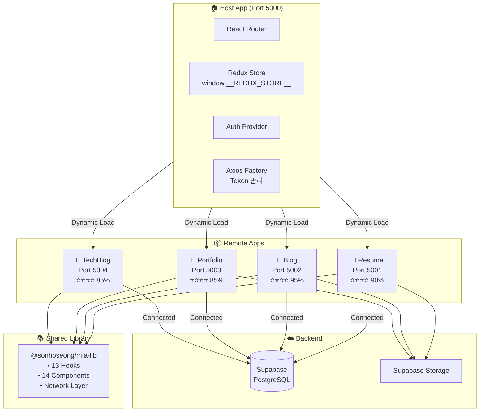

# MFA Portfolio - TODO Tracker

> Last Updated: 2026-04-20

---

## 🏗️ Architecture Overview

---

## 📊 Progress Overview

| App | 완성도 | Status | Priority | 주요 이슈 |
|-----|--------|--------|----------|-----------|
| **Resume** (Remote 1) | ⭐⭐⭐⭐ 90% | 🟢 DONE | - | ✅ Admin CRUD 완료, 이미지 업로드 완료 |
| **Blog** (Remote 2) | ⭐⭐⭐⭐ 95% | 🟡 TODO | P1 | 검색/필터, 소셜 공유, SEO 최적화 필요 |
| **Portfolio** (Remote 3) | ⭐⭐⭐⭐ 85% | 🟡 TODO | P1 | 좋아요 기능, 애널리틱스 대시보드 필요 |
| **TechBlog** (Remote 4) | ⭐⭐⭐⭐ 85% | 🟡 TODO | P2 | 급여 추적, 면접 준비 모듈 필요 |

---

## ✅ Completed Phases

### Phase 0: Type Safety & Error Handling (완료)
- [x] Redux `state: any` → 타입 안전 셀렉터 사용 (`selectAccessToken`, `selectUser`)
- [x] `catch (err: any)` → `getErrorMessage()` 헬퍼 패턴 적용
- [x] API 응답에 명시적 인터페이스 추가 (`RawComment`, `PostTagJoin`)
- [x] `isAxiosError()` 타입 가드 도입

### Phase 1: TechBlog Supabase 연동 (완료)
- [x] Database 스키마 (`jobs`, `job_applications`, `job_notes`, `calendar_events`)
- [x] API Layer 구현 (7 API 모듈)
- [x] Hooks 구현 (6 커스텀 훅)
- [x] Mock 데이터 교체 (graceful fallback 지원)
- [x] 모달/버튼 연결 완료

### Phase 2: Resume Admin 완성 (완료)
- [x] Experience CRUD 연동
- [x] Projects CRUD 연동
- [x] Resume profile CRUD 연동
- [x] 프로필 이미지 업로드 (Supabase Storage)

### Phase 3: Portfolio 기능 확장 (완료)
- [x] 좋아요 기능 (Optimistic Update)
- [x] 공유 기능 (ShareButton 컴포넌트)
- [x] 댓글 스레딩 시스템

### Phase 4: Blog 검색/필터 (완료)
- [x] SearchBar 통합
- [x] 태그 필터링 구현
- [x] 복합 필터 UI

---

## 🚀 Advanced Features Roadmap

### 📝 Blog (Remote 2) - 고급 기능

#### P1: 소셜 공유 & SEO (예상 2시간)
- [ ] **소셜 공유 버튼**
  - 파일: `apps/blog/src/components/ShareButtons.tsx`
  - Twitter, Facebook, LinkedIn, 링크 복사
  - URL 인코딩, meta description 포함

- [ ] **SEO 메타 태그**
  - 파일: `apps/blog/src/components/SEOHead.tsx`
  - react-helmet-async 사용
  - Open Graph, Twitter Cards

#### P2: 사용자 경험 개선 (예상 3시간)
- [ ] **관련 포스트 추천**
  - 같은 카테고리/태그 기반 추천
  - 파일: `apps/blog/src/components/RelatedPosts.tsx`

- [ ] **읽기 진행률 표시**
  - 스크롤 기반 프로그레스 바
  - 파일: `apps/blog/src/components/ReadingProgress.tsx`

- [ ] **목차 자동 생성**
  - H2/H3 헤딩 추출
  - 사이드바 sticky 목차
  - 파일: `apps/blog/src/components/TableOfContents.tsx`

#### P3: Analytics & 최적화 (예상 2시간)
- [ ] **조회수 트래킹**
  - blog_posts.view_count 업데이트
  - IP 기반 중복 방지

- [ ] **sitemap.xml 생성**
  - 빌드 시 자동 생성 스크립트
  - 파일: `apps/blog/scripts/generate-sitemap.ts`

- [ ] **RSS 피드**
  - XML 피드 자동 생성
  - 파일: `apps/blog/public/rss.xml`

---

### 🎨 Portfolio (Remote 3) - 고급 기능

#### P1: Analytics Dashboard (예상 3시간)
- [ ] **포트폴리오 통계 대시보드**
  - 총 조회수, 좋아요 수, 댓글 수 집계
  - 인기 프로젝트 순위
  - 파일: `apps/portfolio/src/pages/analytics/AnalyticsPage.tsx`

- [ ] **조회수 차트**
  - 일별/주별 조회수 트렌드
  - 간단한 CSS 막대 차트 (라이브러리 없이)

#### P2: 프로젝트 정렬 & 필터 (예상 2시간)
- [ ] **정렬 옵션**
  - 최신순, 인기순(조회수), 좋아요순
  - 파일: `apps/portfolio/src/pages/home/HomePage.tsx`

- [ ] **카테고리 페이지**
  - `/category/:slug` 라우트
  - 카테고리별 필터링

#### P3: 갤러리 기능 (예상 2시간)
- [ ] **이미지 라이트박스**
  - 이미지 클릭 시 모달 확대
  - 좌/우 네비게이션
  - 파일: `apps/portfolio/src/components/Lightbox.tsx`

- [ ] **다중 이미지 업로드**
  - 프로젝트당 여러 스크린샷
  - 드래그 앤 드롭 지원

#### P4: 알림 시스템 (예상 2시간)
- [ ] **댓글 알림**
  - 새 댓글/답글 알림
  - 알림 목록 페이지
  - DB: `notifications` 테이블 필요

---

### 📄 Resume (Remote 1) - 고급 기능

#### P1: 드래그 앤 드롭 (예상 3시간)
- [ ] **섹션 순서 변경**
  - Experience, Projects, Skills 순서 커스터마이징
  - react-beautiful-dnd 또는 @dnd-kit/core 사용
  - 파일: `apps/resume/src/pages/admin/AdminPage.tsx`

- [ ] **항목 순서 변경**
  - 경력/프로젝트 내 순서 드래그
  - order_index 필드 업데이트

#### P2: PDF 내보내기 (예상 2시간)
- [ ] **PDF 미리보기**
  - 인쇄용 스타일시트
  - 파일: `apps/resume/src/styles/print.css`

- [ ] **PDF 다운로드**
  - html2pdf.js 또는 react-to-print 사용
  - 파일: `apps/resume/src/utils/exportPdf.ts`

#### P3: 템플릿 시스템 (예상 3시간)
- [ ] **템플릿 선택**
  - 2-3개 이력서 테마
  - Modern, Classic, Minimal

- [ ] **색상 커스터마이징**
  - 주요 색상 선택
  - CSS 변수 동적 변경

#### P4: 자격증 섹션 (예상 1시간)
- [ ] **Certifications CRUD**
  - 새 테이블: `resume_certifications`
  - 파일: `apps/resume/src/pages/admin/CertificationsPage.tsx`

---

### 💼 TechBlog (Remote 4) - 고급 기능

#### P1: 급여 추적 (예상 2시간)
- [ ] **급여 정보 필드**
  - 제안 연봉, 협상 결과
  - 파일: `apps/techblog/src/components/SalaryModal.tsx`

- [ ] **급여 통계**
  - 평균 제안 연봉
  - 회사별 연봉 비교 (익명화)

#### P2: 면접 준비 모듈 (예상 3시간)
- [ ] **면접 질문 관리**
  - 기술 면접 예상 질문
  - 내 답변 작성 및 저장
  - DB: `interview_questions` 테이블
  - 파일: `apps/techblog/src/pages/interview/InterviewPrepPage.tsx`

- [ ] **면접 노트**
  - 실제 면접 후 회고 작성
  - 질문/답변 기록

#### P3: 지원 소스 추적 (예상 1시간)
- [ ] **지원 경로 필드**
  - 사람인, 원티드, 잡코리아, 직접 지원 등
  - 통계: 경로별 합격률

- [ ] **경로별 분석**
  - 어떤 채널이 효과적인지 시각화

#### P4: 이메일 템플릿 (예상 2시간)
- [ ] **지원 이메일 템플릿**
  - 회사명, 포지션 자동 삽입
  - 복사 버튼
  - 파일: `apps/techblog/src/components/EmailTemplateModal.tsx`

- [ ] **감사 이메일 템플릿**
  - 면접 후 감사 이메일
  - 결과 확인 이메일

---

## 🎯 Quick Wins (즉시 구현 가능)

| Feature | App | 예상 시간 | Impact |
|---------|-----|----------|--------|
| 소셜 공유 버튼 | Blog | 30분 | High |
| SEO 메타 태그 | Blog | 30분 | High |
| 정렬 옵션 추가 | Portfolio | 30분 | Medium |
| 읽기 진행률 | Blog | 30분 | Medium |
| 지원 소스 필드 | TechBlog | 30분 | Medium |
| 급여 필드 추가 | TechBlog | 30분 | Medium |

---

## 🛠️ Technical Debt

### 코드 품질
- [ ] 중복 컴포넌트 lib으로 통합 (UserFloatingMenu, TiptapEditor)
- [ ] 미사용 의존성 제거 (jsonwebtoken, @vercel/node)
- [ ] console.log 정리
- [x] `any` 타입 제거 완료

### 성능
- [ ] 번들 사이즈 추가 최적화
- [ ] 코드 스플리팅 검토
- [ ] 이미지 추가 최적화

### 테스트
- [ ] 단위 테스트 추가
- [ ] E2E 테스트 구축
- [ ] CI/CD 파이프라인

---

## 📊 Feature Matrix

| Feature | Resume | Blog | Portfolio | TechBlog |
|---------|:------:|:----:|:---------:|:--------:|
| CRUD Operations | ✅ | ✅ | ✅ | ✅ |
| Rich Text Editor | ✅ | ✅ | ✅ | ❌ |
| Database (Supabase) | ✅ | ✅ | ✅ | ✅ |
| Authentication | ✅ | ✅ | ✅ | ✅ |
| Comments | ✅ | ✅ | ✅ | ❌ |
| Search | ⚠️ | ✅ | ✅ | ✅ |
| Image Upload | ✅ | ✅ | ✅ | ❌ |
| Likes/Favorites | ❌ | ⚠️ | ✅ | ✅ |
| Social Share | ❌ | ⚠️ | ✅ | ❌ |
| Analytics | ❌ | ⚠️ | ⚠️ | ✅ |
| SEO Meta | ❌ | ⚠️ | ❌ | ❌ |
| PDF Export | ⚠️ | ❌ | ❌ | ❌ |
| Drag & Drop | ❌ | ❌ | ❌ | ❌ |
| Email Templates | ❌ | ❌ | ❌ | ⚠️ |

**Legend**: ✅ Complete | ⚠️ Partial/Planned | ❌ Missing

---

## 🔑 Key Files Reference

### Architecture Critical
| File | Description |
|------|-------------|
| `apps/host/webpack.common.js` | Dynamic remote loader (KOMCA Pattern) |
| `apps/host/src/App.tsx` | Main container logic |
| `packages/lib/src/store/` | Redux configuration |
| `packages/lib/src/network/axios-factory.ts` | Token management |

### Per App Entry Points
| App | Main Entry | Routes |
|-----|------------|--------|
| Resume | `apps/resume/src/App.tsx` | `src/pages/routes/` |
| Blog | `apps/blog/src/App.tsx` | `src/pages/routes/` |
| Portfolio | `apps/portfolio/src/App.tsx` | `src/pages/routes/` |
| TechBlog | `apps/techblog/src/App.tsx` | `src/pages/routes/` |

---

*Generated: 2026-04-20*
